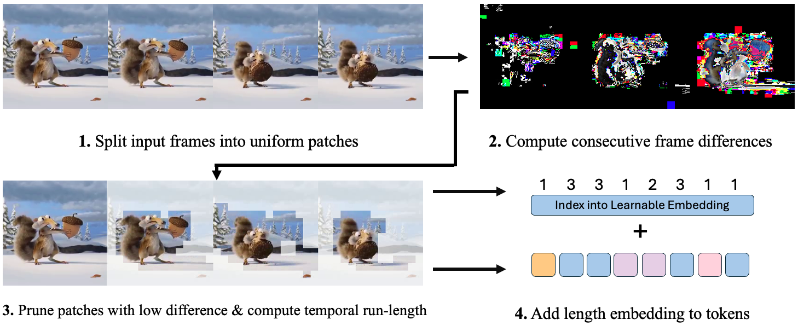

# Don’t Look Twice: Faster Video Transformers with Run-Length Tokenization

Official code for ["Don't Look Twice: Faster Video Transformers with Run-Length Tokenization"](https://arxiv.org/abs/2411.05222) at NeurIPS 2024 (spotlight).

[Rohan Choudhury](https://rccchoudhury.github.io/), Guanglei Zhu, Sihan Liu, Koichiro Niinuma, [Kris Kitani](https://www.cs.cmu.edu/~kkitani/), [László Jeni](https://www.laszlojeni.com)  
Robotics Institute, Carnegie Mellon University

<a name="Abstract"></a>
## Abstract

<div style="text-align: justify;">
Transformers are slow to train on videos due to extremely large numbers of input tokens, even though many video tokens are repeated over time. Existing methods to remove such uninformative tokens either have significant overhead, negating any speedup, or require tuning for different datasets and examples.We present Run-Length Tokenization (RLT), a simple approach to speed up video transformers inspired by run-length encoding for data compression. RLT efficiently finds and removes 'runs' of patches that are repeated over time prior to model inference, then replaces them with a single patch and a positional encoding to represent the resulting token's new length. Our method is *content-aware*, requiring no tuning for different datasets, and *fast*, incurring negligible overhead. RLT yields a large speedup in training, reducing the wall-clock time to fine-tune a video transformer by 30% while matching baseline model performance. RLT also works *without any training*, increasing model throughput by 35% with only 0.1% drop in accuracy.RLT speeds up training at 30 FPS by more than 100%, and on longer video datasets, can reduce the token count by up to 80%.
</div>

<a name="Overview"></a>
## Approach Overview



## Installation

Clone our repo recursively:

```bash
git clone --recursive https://github.com/rohan-choudhury/rlt.git
cd rlt
```

The recursive is important to ensure that submodules are cloned as well.

### Environment Setup
We use `mamba` for environment management. Set up the environment with the following:

```bash
mamba env create -f environment.yaml
mamba activate rlt
```

### Compile Decord
We use AVION's fast decode ops for efficient video decoding. Please refer [these instructions](https://github.com/zhaoyue-zephyrus/AVION/blob/main/docs/INSTALL.md) for setting up Decord. We restate them briefly here. 

Go to the `decord` directory and run the following commands to compile the library:

```bash
cd third_party/decord
mkdir build && cd build
cmake .. -DCMAKE_BUILD_TYPE=Release
make
```
Then, set up the python bindings: 

```bash
cd ../python
python3 setup.py install --user
```
If there are errors or issues with the path installation, please refer to the [Decord installation instructions](https://github.com/zhaoyue-zephyrus/AVION/blob/main/docs/INSTALL.md). Alternatively, you can use the `pip install decord` command to install the standard version of the library without the faster cropping operations, but you will likely run into dataloading bottlenecks.

## Datasets

We provide detailed instructions for downloading and setting up the Kinetics-400 and Something-Something V2 datasets in [DATASETS.md](DATASETS.md).

## Pretrained Checkpoints

We provide checkpoints for different model scales that can be used to measure the effect of RLT-out-of-the-box. These are finetuned on Kinetics from the original VideoMAE-2 repo. For fine-tuning models, we suggest using the checkpoints provided in the original VideoMAE-2 repo, which are not fine-tuned. If there are any additional checkpoints you would like, please feel free to post an issue and we will respond as soon as possible.

| Model    | Dataset      | Top-1 Accuracy (base) | Top-1 Accuracy (RLT) | Pretrained Checkpoint |
|----------|--------------|:---------------------:|:--------------------:|:---------------------:|
| ViT-B/16 | Kinetics-400 | 80.9                  | 80.9                 | [Download Link](https://drive.google.com/file/d/18EEgdXY9347yK3Yb28O-GxFMbk41F6Ne/view?usp=sharing) |
| ViT-L/16 | Kinetics-400 | 84.7                  | 84.7                 | [Download Link](https://drive.google.com/file/d/1jX1CiqxSkCfc94y8FRW1YGHy-GNvHCuD/view?usp=sharing) |
| ViT-H/16 | Kinetics-400 | 86.2                  | 86.2                 | [Download Link](https://drive.google.com/file/d/104ouJZxSVPSAm0LwJXd6IzjdA_RGLqZi/view?usp=sharing) |


## Evaluation
To run standard evaluation on Kinetics, use the following command:

```bash
# eval on Kinetics
python src/train.py experiment=val_vit_mae.yaml

```
To run evaluation with RLT turned on, use
```bash
# eval on Kinetics with RLT
python src/train.py experiment=val_vit_mae.yaml model.tokenizer_cfg.drop_policy='rlt'
```

## Training
Similarly, to run training, use the following command:
```bash
# train on Kinetics
python src/train.py experiment=train_vit_mae.yaml

```

By default, RLT is not enabled. To use, you can explicity set the flag in the command line as in the evaluation step, or set it in the config file directly. You can also enable the length encoding scheme from the paper by modifying the config file accordingly. Finally, we provide support for logging with Weights&Biases, but this is turned off by default. To turn it back on, uncomment the `logger: wandb` line in the config file.

## Citation

If you use our code or the paper, cite our work:

```
@article{choudhury2024rlt,
author = {Rohan Choudhury and Guanglei Zhu and Sihan Liu and Koichiro Niinuma and Kris Kitani and László Jeni},
title = {Don't Look Twice: Faster Video Transformers with Run-Length Tokenization},
booktitle = {Advances in Neural Information Processing Systems},
year = {2024}
}
```
